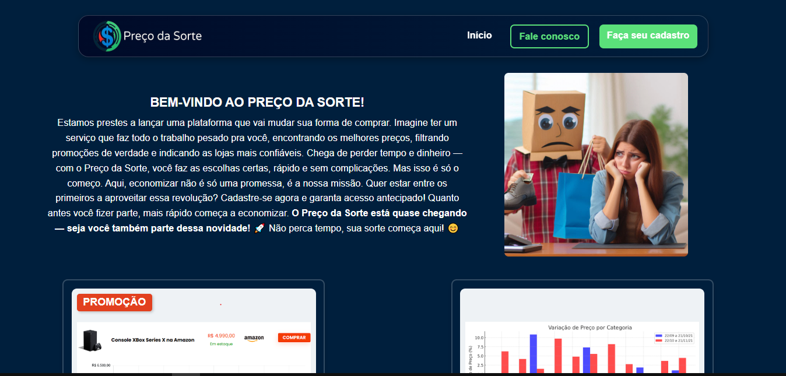

# 💰 Preço da Sorte

> Landing page desenvolvida para apresentar a proposta do **Preço da Sorte**, uma plataforma voltada à busca e comparação de preços, com foco em uma experiência simples, visual e intuitiva.

## 📌 Sobre o projeto

O **Preço da Sorte** é uma landing page criada para apresentar a proposta de uma plataforma de comparação de preços e despertar o interesse de potenciais usuários.

A página foi desenvolvida com foco na apresentação visual do projeto, organização das informações e experiência de navegação, utilizando diferentes elementos como imagens, vídeos, cards e formulários.

Ao final da página, o usuário também pode realizar um **pré-cadastro**, demonstrando interesse em acompanhar o projeto.

Este projeto foi desenvolvido como prática de desenvolvimento web, permitindo aplicar conhecimentos de **HTML5 e CSS3**, além de conceitos de estruturação, estilização e organização de uma página completa.

---

## 🎯 Objetivo

O principal objetivo do projeto é criar uma **landing page atrativa e intuitiva** para apresentar o conceito do Preço da Sorte.

A página busca:

* Apresentar a proposta da plataforma;
* Demonstrar possíveis benefícios para o usuário;
* Organizar informações de forma visual;
* Apresentar produtos e ofertas;
* Incentivar o usuário a conhecer a proposta;
* Permitir que pessoas interessadas realizem um pré-cadastro.

---

## ✨ Funcionalidades

* 🏠 Página inicial com apresentação do projeto;
* 📋 Seções informativas sobre a proposta;
* 🛍️ Apresentação de produtos e ofertas;
* 💰 Conteúdos relacionados à comparação de preços;
* 🎥 Utilização de vídeos e elementos visuais;
* 📩 Formulário de contato;
* 👤 Formulário de pré-cadastro;
* 🔗 Navegação entre as diferentes seções da página;
* 🖼️ Utilização de imagens para complementar a experiência visual.

---

## 🛠️ Tecnologias utilizadas

### Front-end

* **HTML5**
* **CSS3**

### Publicação

* **Vercel**

---

## 📂 Estrutura do projeto

```text
Preco-da-Sorte/
│
├── css/
│   └── style.css
│
├── img/
│   ├── imagens
│   └── vídeos
│
├── index.html
│
└── README.md
```

---

## 🖥️ Demonstração

O projeto está publicado e disponível online através da Vercel:

🔗 **[Acessar o Preço da Sorte](https://preco-da-sorte.vercel.app/)**

---

## 📷 Preview



---

## 📱 Experiência do usuário

Durante o desenvolvimento, foi buscada uma organização visual que facilitasse a navegação e permitisse que o usuário compreendesse rapidamente a proposta do projeto.

A landing page utiliza diferentes seções para apresentar as informações de forma progressiva, conduzindo o usuário desde a apresentação inicial até o formulário de pré-cadastro.

---

## 📚 O que foi praticado

O desenvolvimento do projeto proporcionou a prática de conceitos fundamentais de desenvolvimento web, incluindo:

* Estruturação de páginas utilizando HTML5;
* Organização de elementos e seções;
* Utilização de imagens e vídeos;
* Criação e estilização de formulários;
* Desenvolvimento de layouts utilizando CSS3;
* Organização de arquivos e diretórios;
* Navegação entre seções da página;
* Publicação de um projeto web utilizando Vercel.

---

## 🔮 Possíveis melhorias

Como parte da evolução do projeto, algumas melhorias podem ser implementadas futuramente:

* [ ] Aprimorar a responsividade para diferentes tamanhos de tela;
* [ ] Adicionar interações utilizando JavaScript;
* [ ] Implementar validações no formulário de pré-cadastro;
* [ ] Integrar o formulário a um serviço de armazenamento de leads;
* [ ] Melhorar acessibilidade;
* [ ] Aprimorar animações e transições;
* [ ] Otimizar imagens e vídeos para melhorar o desempenho;
* [ ] Melhorar a experiência em dispositivos móveis.

---

## 🚀 Como executar o projeto

Como o projeto é uma landing page desenvolvida com HTML e CSS, não é necessário instalar dependências para executá-lo localmente.

### 1. Clone o repositório

```bash
git clone https://github.com/LucasPortoGomes/Preco-da-Sorte.git
```

### 2. Acesse a pasta

```bash
cd Preco-da-Sorte
```

### 3. Abra o projeto

Abra o arquivo:

```text
index.html
```

Você também pode utilizar uma extensão como **Live Server** no Visual Studio Code para visualizar o projeto durante o desenvolvimento.

---

## 👨‍💻 Autor

### Lucas Porto Gomes

Estudante de tecnologia e desenvolvedor em formação, atualmente aprimorando conhecimentos em desenvolvimento web, lógica de programação e linguagens como **JavaScript, Java, Python e SQL**.

### 🔗 Onde me encontrar

* 💻 **GitHub:** [LucasPortoGomes](https://github.com/LucasPortoGomes)
* 🌐 **Projeto:** [Preço da Sorte](https://preco-da-sorte.vercel.app/)

---

⭐ Se você gostou do projeto, considere deixar uma estrela no repositório!
